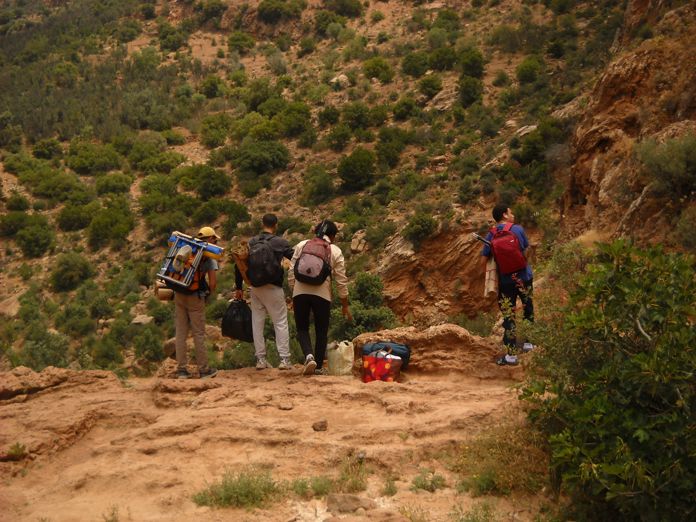
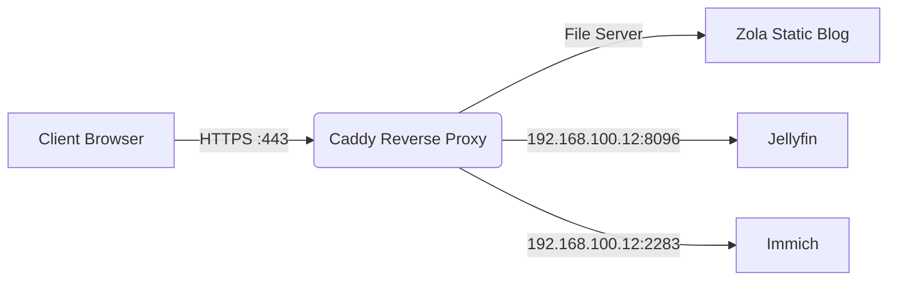

+++
title = "The Ultimate Zola & Serene Writing Cheat Sheet"
description = "A complete reference post testing typography, code blocks, math, diagrams, and embedded media."
date = 2026-09-29
updated = 2026-09-29
draft = false

[taxonomies]
categories = ["Guides"]
tags = ["zola", "markdown", "media"]

[extra]
lang = "en"
toc = true           # Enables the floating Table of Contents
copy = true          # Adds a Copy button to code blocks
math = true          # Enables KaTeX math rendering
mermaid = true       # Enables Mermaid diagrams
outdate_alert = true # Warns readers if the post is old
outdate_alert_days = 365
+++

This post serves as a complete reference for every formatting feature and media embed available in **Zola** with the **Serene** theme.

---

## 1. Text Formatting & Typography

Standard Markdown covers **bold text**, *italic text*, ***bold and italic***, ~~strikethrough~~, and `inline code`. 

Because Markdown allows inline HTML, you can also use:
* **Highlighted text:** <mark>Important highlighted phrase</mark>
* **Keyboard shortcuts:** Press <kbd>Ctrl</kbd> + <kbd>C</kbd> to stop the server.
* **Subscript & Superscript:** H<sub>2</sub>O and 2<sup>10</sup> = 1024.
* **Footnotes:** Here is a statement that needs a source.[^1]

[^1]: This is the footnote content—it automatically links to the bottom of the article and back!

---

## 2. Callouts, Quotes & Collapsible Spoilers

Serene supports GitHub-style callout boxes using blockquotes:

> [!NOTE]
> Useful information that readers should know, even when skimming content.

> [!TIP]
> Helpful advice for doing things better or more easily.

> [!IMPORTANT]
> Key information users need to know to achieve their goal.

> [!WARNING]
> Urgent info that needs immediate user attention to avoid problems.

> [!CAUTION]
> Advises about risks or negative outcomes of certain actions.

### Standard Blockquote
> "Talk is cheap. Show me the code."
> — *Linus Torvalds*

### Collapsible Spoiler / Details Block
<details>
<summary><strong>Click to view full terminal log output</strong></summary>

```text
[INFO] Starting server on 192.168.100.12:8080
[INFO] TLS certificate loaded for *.yourdomain.com
[OK] Ready to accept connections.
```
</details>

---

## 3. Importing Media (Photos, Video & Audio)

### A. Photos (Standard & With Captions)
If `setup-photo.jpg` is in the same folder as `index.md` (or in `static/setup-photo.jpg`):

**1. Standard Markdown Image:**


**2. Image with Caption and Custom Width (HTML `<figure>`):**
<figure style="text-align: center; margin: 2rem 0;">
  
  <figcaption style="font-size: 0.9em; opacity: 0.75; margin-top: 0.5rem;">
    Figure 1: Custom buck converter wiring on the chassis (Shot on Fujifilm X-S20).
  </figcaption>
</figure>

---

### D. Audio Files (`.mp3` / `.wav` / `.ogg`)
Drop an audio file like `guitar-riff.mp3` into the post folder and use the native `<audio>` player:

<figure style="margin: 1.5rem 0;">
  <figcaption style="margin-bottom: 0.5rem; font-weight: 600;">Acoustic Guitar Recording — Take 1:</figcaption>
  <audio controls preload="metadata" style="width: 100%;">
    <source src="guitar-riff.mp3" type="audio/mpeg">
    Your browser does not support the audio element.
  </audio>
</figure>

---

## 4. Code Blocks (With Line Numbers & Highlighting)

Zola has built-in parameters you can pass right after the language name:
* `linenos`: Adds line numbers.
* `hl_lines=[2, "5-6"]`: Highlights specific lines or ranges!
* `linenostart=10`: Starts numbering at line 10.

```rust,linenos,hl_lines=[3,"6-7"]
fn main() {
    let server_ip = "192.168.100.12";
    println!("Routing traffic to {}", server_ip); // Highlighted line 3

    for port in [8096, 4533, 2283] {
        // Lines 6 and 7 are highlighted
        check_port(server_ip, port);
    }
}
```

---

## 5. Diagrams (Mermaid)

Because `mermaid = true` is set in the frontmatter, any `mermaid` code block automatically turns into a theme-aware diagram:



---

## 6. Math Equations (KaTeX)

With `math = true` in the frontmatter, you can write inline math like $E = mc^2$ or $\omega = 2\pi f$, as well as full display equations:

$$
u(t) = K_p e(t) + K_i \int_0^t e(\tau) \,d\tau + K_d \frac{de(t)}{dt}
$$

---

## 7. Tables & Task Lists

| Service | Local Port | Subdomain | Status |
| :--- | :---: | :--- | :---: |
| **Caddy** | `443` | `*.yourdomain.com` | Active |
| **Jellyfin** | `8096` | `jellyfin.yourdomain.com` | Active |
| **Immich** | `2283` | `immich.yourdomain.com` | Active |

### Project Checklist
- [x] Migrate reverse proxy to Caddy
- [x] Set up Dynamic DNS with Cloudflare
- [x] Configure Zola with the Serene theme
- [ ] Fix the Photography gallery section